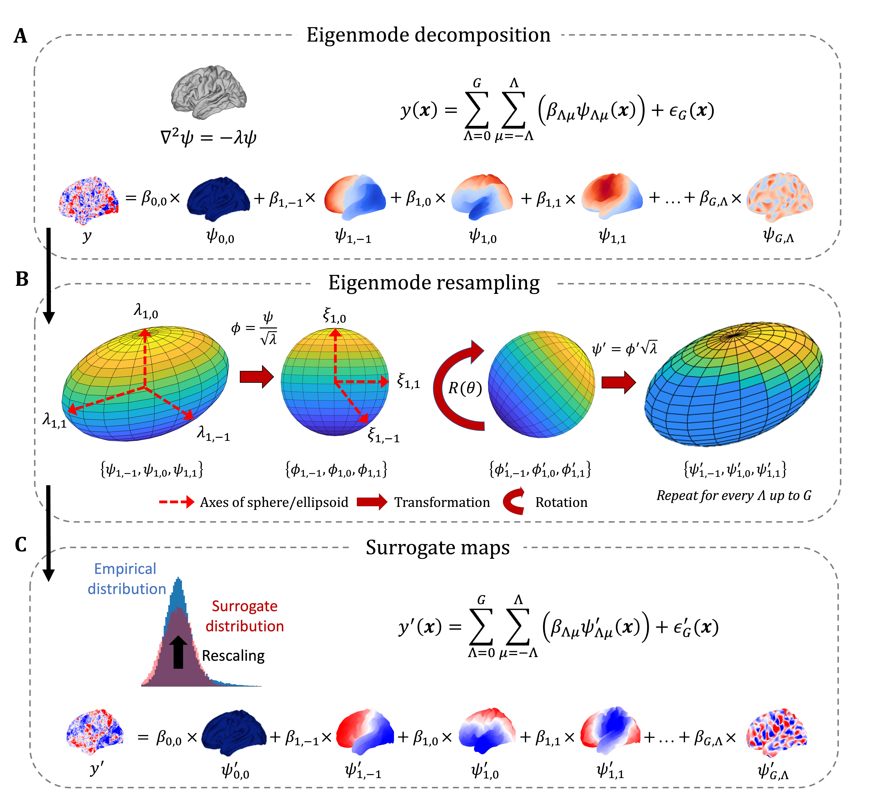

|

.. image:: https://zenodo.org/badge/710175458.svg
  :target: https://zenodo.org/doi/10.5281/zenodo.10583040
  :alt: Zenodo DOI

.. image:: https://github.com/SNG-newy/eigenstrapping/actions/workflows/tests.yml/badge.svg
  :target: https://github.com/SNG-newy/eigenstrapping/actions/workflows/tests.yml
  :alt: run-tests status

.. image:: https://github.com/SNG-newy/eigenstrapping/actions/workflows/docs.yml/badge.svg
  :target: https://eigenstrapping.readthedocs.io/en/latest/
  :alt: deploy-docs status

|

The ``eigenstrapping`` toolbox is designed to help researchers generate
statistically-rigorous models for null hypothesis testing between brain maps using
non-local spectral shape descriptors - or geometric eigenmodes.
Documentation can be found `here <https://eigenstrapping.readthedocs.io/en/latest/>`_. Read our preprint `<https://dx.doi.org/10.1101/2024.02.07.579070>`_

Features
--------

- A growing library of eigenmodes of standard surfaces and surface densities (fsaverage, fsLR)
- Cortical and subcortical null models for assessing statistical correspondence between brain maps
- Generation of geometric eigenmodes on user-derived surfaces

Installation Guide
------------------

Eigenstrapping is available in Python 3.7+. MATLAB version coming soon!

Installation
============

eigenstrapping can be installed by downloading the package from the Github repository: ::

    git clone https://github.com/SNG-newy/eigenstrapping.git
    cd eigenstrapping
    python3 -m pip install .

Dependencies
============

To run eigenstrapping, the following Python packages are required (these should be automatically installed with the above command(s), as listed in the ``requirements.txt`` file):

* `numpy <https://numpy.org/>`_
* `scipy <https://scipy.org/scipylib/index.html>`_
* `scikit-learn <https://scikit-learn.org/stable/>`_
* `lapy <https://github.com/DeepMI/lapy>`_
* `matplotlib <https://matplotlib.org/>`_
* `nibabel <https://nipy.org/nibabel/index.html>`_
* `nilearn <https://nilearn.github.io/>`_
* `pandas <https://pandas.pydata.org/>`_
* `brainspace <https://github.com/MICA-MNI/BrainSpace/tree/master/>`_
* `netneurotools <https://github.com/netneurolab/netneurotools>`_

``nibabel`` and ``nilearn`` are required for surfaces and volumes. ``matplotlib``
is only required for fitting plots in `eigenstrapping.fit` and some of the surface
plotting functions. Future improvements will reduce the number of dependencies
needed.

Important additional dependencies
=================================

In order to avail the user of the volumetric pipeline, the following packages must be installed and sourced correctly:

* `Connectome Workbench <https://www.humanconnectome.org/software/connectome-workbench>`_
* `FreeSurfer 6.0.0+ <https://surfer.nmr.mgh.harvard.edu/fswiki/DownloadAndInstall>`_
* `gmsh <https://gmsh.info/>`_

Optional dependencies
=====================

In order to speed up calculation of eigenmodes, you can utilize ``scikit-sparse`` libraries
to use Cholesky decomposition rather than LU decomposition. If these libraries are already
installed, the functions in ``eigenstrapping`` will automagically recognize this and use these
libraries, without the user specifying (as default behavior, this can be turned off.

You can install these libraries by following the instructions: `scikit-sparse <https://github.com/scikit-sparse/scikit-sparse>`_.

Citing
------

When using ``eigenstrapping``, please cite the following manuscript:

* Generation of surrogate brain maps preserving spatial autocorrelation through random rotation of geometric eigenmodes. Koussis, N.C., Pang, J.C., Jeganathan, J., Paton, B., Fornito, A., Robinson, P.A., Misic, B., Breakspear, M. (2024). bioRxiv 2024.02.07.579070 [Preprint]. `<https://dx.doi.org/10.1101/2024.02.07.579070>`_

The core functions expand on code from `BrainEigenmodes <https://github.com/NSBLab/BrainEigenmodes>`_, please cite their work if you use our code:

* Geometric constraints on human brain function. Pang, J. C., Aquino, K. M., Oldehinkel, M., Robinson, P. A., Fulcher, B. D., Breakspear, M., & Fornito, A. (2023). Nature, 1-9. `<https://doi.org/10.1038/s41586-023-06098-1>`_

Please also cite the papers for the method that we use to calculate eigenmodes on the surface:

* Laplace-Beltrami spectra as 'Shape-DNA' of surfaces and solids. Reuter M, Wolter F-E, Peinecke N. Computer-Aided Design. 2006;38(4):342-366. `<http://dx.doi.org/10.1016/j.cad.2005.10.011>`_

* BrainPrint: a discriminative characterization of brain morphology. Wachinger C, Golland P, Kremen W, Fischl B, Reuter M. Neuroimage. 2015;109:232-48. `<http://dx.doi.org/10.1016/j.neuroimage.2015.01.032>`_ `<http://www.ncbi.nlm.nih.gov/pubmed/25613439>`_

And if you use the Heat Kernel for Geodesics method in `eigenstrapping.geometry.geodesic_distmat`:

* Crane, K., Weischedel, C., & Wardetzky, M. (2013). Geodesics in heat: A new approach to computing distance based on heat flow. ACM Transactions on Graphics (TOG), 32(5), 1-11. `<https://arxiv.org/pdf/1204.6216>`_

License information
-------------------

This work is licensed under a
Creative Commons Attribution-NonCommercial-ShareAlike 4.0 International License ``cc-by-nc-sa``.
The full license can be found in the
`LICENSE <https://github.com/SNG-newy/eigenstrapping/blob/main/
/LICENSE>`_ file in the ``eigenstrapping`` distribution.
