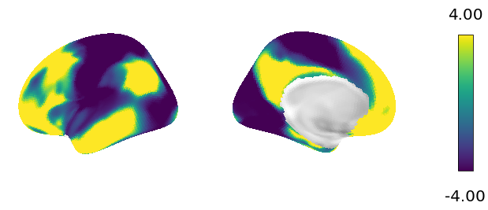

.. _gettingstarted:

Getting Started
===============

Quick introduction to brain maps and eigenmodes
-----------------------------------------------

Patterns on the cortical surface or in the subcortex ("brain maps") more often
than not express with smoothness - spatial autocorrelation. Accounting
for this in statistical testing of the associations between or the influence
that one brain map has on another is a non-trivial problem. More recently,
methods that account for smoothness have been developed, but these carry their own
issues (see our `paper <https://null.null>`_ for an in-depth discussion on this topic).

Eigenmodes of a surface encode all pairwise (auto)correlations (i.e., smoothness).
The reason for this is too maths heavy for a quick intro, but suffice to say
that this has been discussed many times by people smarter than the people who came up with
this method (see :ref:`References <references>`).

Eigenstrapping offers a solution by leveraging this fact, and another property of
eigenmodes: they are orthogonal. By taking random rotations of them, one can
create new brain maps with the same smoothness but randomized topology. The steps
below will help you get started and build your own surrogate maps.

Input data types
----------------

``eigenstrapping`` requires a few inputs:

* A brain map, i.e., a one-dimensional vector, and
Either:
    * A surface mesh, i.e., a set of vertices and face indices
    * A set of eigenmodes and corresponding eigenvalues
    
For the first run, we will load all of these files from the example dataset,
but let's assume that these files have already been generated. In :ref:`Tutorial 3 <tutorial_ownsurface>`,
we will learn how to use a surface mesh to generate eigenmodes. In :ref:`Tutorial 1 <tutorial_cortex>`,
we will learn how to generate and load a distance matrix to evaluate variogram fits
in order to tune the number of modes used for the eigendecomposition.

``eigenstrapping`` can handle a variety of inputs:

* Delimited `*.txt` files
* Neuroimaging files such as `*.nii`, `*.gii`, or `*scalar.gii`
* Data and memory-mapped distance matrices written to `*.npy` files
* Numpy arrays and array-like objects

First run
---------

The package comes with example surfaces (and their eigenmodes) and cortical gradient data 
from Margulies' 2015 paper (see :ref:`References <references>`). Let's start by importing the data (this may take
a few moments):

.. code-block:: py

    >>> from eigenstrapping.datasets import load_surface_examples
        
    >>> # load left and right hemispheres
    >>> surf_lh, surf_rh, data_lh, data_rh, emodes_lh, emodes_rh, evals_lh, evals_rh = load_surface_examples(with_surface=True)
    >>> surf_lh
    '/mnt/e-data/surfaces/space-fsaverage_den-10k_hemi-lh_pial.surf.gii'
    
    >>> data_lh.shape
    (10242,)
    
    >>> emodes_lh.shape
    (10242, 1000)
    
    >>> evals_lh.shape
    (1000,)
    
Now let's plot the data on the surface.

.. code-block:: py

    >>> from eigenstrapping.plotting import csplot
    
    >>> csplot(data_lh, 'fsaverage')
    

Now let's make a surrogate brain map and plot it on the surface.

.. code-block:: py

    >>> from eigenstrapping import SurfaceEigenstrapping
    
    
    >>> eigen = SurfaceEigenstrapping(
                    data=data_lh,
                    emodes=emodes_lh,
                    evals=evals_lh,
                    num_modes=100,
                    resample=True,
                    )
    No surface given, expecting precomputed eigenvalues and eigenmodes
    IMPORTANT: EIGENMODES MUST BE TRUNCATED AT FIRST NON-ZERO MODE FOR THIS FUNCTION TO WORK
    >>> surr = eigen.generate()
    
    >>> csplot(surr, 'fsaverage')
    
.. image:: ./_static/examples/example_figs/getting_started2.png
   :scale: 70%
   :align: center

Tutorials
---------

For more information on how to use ``eigenstrapping`` on other kinds of data
or to generate surrogate distributions for surface and volumetric maps, follow
the below guides. If you still have questions after going through the guide
you can refer to the :ref:`api_ref` or ask a question on `GitHub <https://github.com/SNG-newy/eigenstrapping/issues>`_.

.. toctree::
   :caption: Table of Contents
   :maxdepth: 2
   
   tutorials/tutorial_cortex.rst
   tutorials/tutorial_subcortex.rst
   tutorials/tutorial_ownsurface.rst