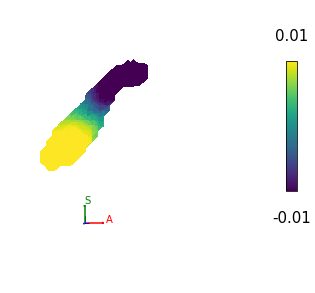

.. _usage_geometry:

Meshes and mesh operations
==========================

.. _usage_geometry_remesh:

Remeshing
---------

Sometimes it is useful to remesh a triangular surface as a tetrahedral mesh and
vice-versa - say, if one wants to derive 3D surfaces within subcortex. This routine
is implemented within the :func:`eigenstrapping.geometry.remesh` function, which
automatically recognizes the surface type (triangles or tetrahedra) and maps the
surface to the other type.

For example, you have a hippocampal volume in MNI152 space (we can load this
from the :func:`eigenstrapping.datasets.fetch_data` function), you can remesh
it from a volume to a triangular mesh. By default these will be generated in the
same folder that the original volume/mesh is in.

.. code-block:: py

    >>> from eigenstrapping.datasets import fetch_data
    
    >>> hipp_lh = fetch_data(
                    name='brainmaps',
                    hemi='lh',
                    format='hippocampus'
                    )
    >>> hipp_lh
    '/mnt/eigenstrapping_data/brainmaps/space-MNI152_res-2mm_hemi-lh_hippocampus.nii.gz'
    
    >>> from eigenstrapping.geometry import remesh
    
    >>> hipp_tria_lh = remesh(hipp_lh)
    >>> hipp_tria_lh
    '/mnt/eigenstrapping_data/brainmaps/space-MNI152_res-2mm_hemi-lh_hippocampus.tria.vtk'
    
You can also remesh from a triangular mesh to a tetrahedral one:

.. code-block:: py

    >>> hipp_tetra_lh = remesh(hipp_tria_lh)
    >>> hipp_tetra_lh
    '/mnt/eigenstrapping_data/brainmaps/space-MNI152_res-2mm_hemi-lh_hippocampus.tria.tetra.vtk'

.. _usage_geometry_eigenmodes:

Deriving eigenmodes from a mesh
-------------------------------

Deriving LBO vector solutions to the Helmholtz equation, or eigenmodes as we refer to them, 
is a fairly trivial process once a mesh has been defined. As graph representations of meshes
are sparse by their very nature (on a triangular mesh, a single vertex
only ever has three edges at the most; four in a tetrahedral mesh), we can use 
sparse methods of deriving these modes.

We use the finite element method as implemented in ``ShapeDNA``, the details
of which can be found in the requisite papers in :ref:`References <references>`.
The form matrices, A and B, are derived either through Cholesky decomposition
using the ``scikit-sparse`` libraries, or LU decomposition in ``scipy.sparse.splu``
if the former is not installed. We recommend, if possible, to install the ``scikit-sparse``
libraries as Cholesky decomposition is much faster than LU.

Let's take our remeshed tetrahedral hippocampus and use :func:`eigenstrapping.geometry.calc_eig`:

.. code-block:: py

    >>> from eigenstrapping import geometry
    >>> tetra = geometry.load_mesh(hipp_tetra_lh)
    >>> # in this case, we'll use eigenstrapping.geometry.calc_eig without sksparse
    >>> emodes, evals = geometry.calc_eig(tetra, num_modes=20) 
    TetMesh with regular Laplace
    Solver: spsolve (LU decomposition) ...
    
    >>> # by default, this function will remove the first (constant) mode
    >>> # this behavior can be changed by setting `return_zero=True` in
    >>> # the calc_eig function
    
    >>> emodes
    array([[ 0.01210057,  0.01249517,  0.00465954, ..., -0.00146934,
            -0.00544099,  0.0271714 ],
           [ 0.01209385,  0.01253431,  0.00548657, ..., -0.00434336,
            -0.00504929,  0.0242422 ],
           [ 0.01198019,  0.01202892,  0.00418164, ..., -0.00095343,
            -0.0038022 ,  0.02745249],
           ...,
           [-0.00412068, -0.01866016,  0.00250916, ...,  0.00476944,
            -0.00805506, -0.00263126],
           [ 0.00052041, -0.01061745, -0.00131715, ...,  0.00542975,
            -0.00041589,  0.01133534],
           [-0.01403812, -0.0024371 ,  0.00991763, ...,  0.02579329,
            -0.02810065,  0.00869789]], dtype=float32)
    
    >>> evals
    array([0.00365112, 0.01341067, 0.02674828, 0.03218102, 0.04489195,
           0.05093223, 0.06653866, 0.07089102, 0.09374754, 0.09695608,
           0.10020526, 0.11701339, 0.12567881, 0.13450024, 0.14623912,
           0.15450524, 0.15965985, 0.16787478, 0.17781733, 0.18272817],
          dtype=float32)
          
    >>> # as you can see, the first column of `emodes` is not constant.

Now, let's plot the first non-constant eigenmode on the surface of the mesh.

.. code-block:: py

    >>> from eigenstrapping import plotting
    
    >>> plotting.meshplot(hipp_tetra_lh, emodes[0], vrange=0.01, colorbar=True)
    

.. _usage_geometry_distance:

Mesh distance calculations
--------------------------

We also provide geodesic (surface) and Euclidean (volumetric) distance calculations
for meshes. Geodesic distance calculation is performed using a heat kernel on
each vertex, and takes about 2 hours for a 32k standard hemisphere (fsLR). See the
paper in :ref:`References <references>` for specific details on the implementation.

In order to calculate the geodesic distance matrix, we use the :func:`eigenstrapping.geometry.geodesic_distmat`
function, which takes an input mesh:

.. code-block:: py

    >>> from eigenstrapping import datasets
    
    >>> surf_lh, *_ = datasets.load_surface_examples(with_surface=True)
    >>> surf_lh
    '/mnt/eigenstrapping-data/surfaces/space-fsaverage_den-10k_hemi-lh_pial.surf.gii'
    
    >>> mesh = geometry.load_mesh(surf_lh)
    >>> # for our purposes, we won't use sksparse libraries, but to do so, we
    >>> # pass `use_cholmod=True` to the function
    >>> distmat_lh = geometry.geodesic_distmat(mesh, use_cholmod=False)
    # eventually ...
    
    >>> distmat_lh.shape
    (10242, 10242)
    
    >>> distmat_lh
    array([[  0.        ,  91.41330719,  73.28165436, ..., 184.62254333,
            186.47727966, 187.92669678],
           [ 91.41330719,   0.        ,  81.62067413, ..., 127.93047333,
            129.78521729, 131.2346344 ],
           [ 73.28165436,  81.62067413,   0.        , ..., 114.22114563,
            116.07588959, 117.52529907],
           ...,
           [184.62254333, 127.93047333, 114.22114563, ...,   0.        ,
              2.80057883,   4.78903866],
           [186.47727966, 129.78521729, 116.07588959, ...,   2.80057883,
              0.        ,   1.98845983],
           [187.92669678, 131.2346344 , 117.52529907, ...,   4.78903866,
              1.98845983,   0.        ]])
              
You can speed things up in the :func:`eigenstrapping.geometry.geodesic_distmat`
function by passing `n_jobs=<number of workers>`. For instance, to use eight threads,
you would pass `n_jobs=8`. To use every available thread, pass `n_jobs=-1`.

Euclidean distance calculation is performed in a similar way:

.. code-block:: py

    >>> distmat_lh = geometry.euclidean_distmat(mesh) # much quicker than geodesic
    >>> distmat_lh.shape
    (10242, 10242)
    
    >>> distmat_lh
    array([[ 0.        , 54.72087326, 37.01728554, ..., 94.95060009,
            93.16259385, 92.16275463],
           [54.72087326,  0.        , 61.99785175, ..., 98.85110323,
            98.2701815 , 98.01616578],
           [37.01728554, 61.99785175,  0.        , ..., 78.64858645,
            77.51088511, 77.12512891],
           ...,
           [94.95060009, 98.85110323, 78.64858645, ...,  0.        ,
             2.80057878,  4.7547238 ],
           [93.16259385, 98.2701815 , 77.51088511, ...,  2.80057878,
             0.        ,  1.98845989],
           [92.16275463, 98.01616578, 77.12512891, ...,  4.7547238 ,
             1.98845989,  0.        ]])
             
Notice the pronounced difference between the two methods. This is because the
cortex is constructed as a 2D sheet (basically the surface of a sphere), so it
is not advisable to use Euclidean distance calculations. For the subcortical
volumes, you would use the Euclidean distance.    

.. _usage_geometry_other:

Other mesh operations
---------------------

Alongside the above functions, there are several useful tools within
the :mod:`eigenstrapping.geometry` module, including calculation of vertex
normals, which may be useful for calculating the action of a function on the mesh:

.. code-block:: py

    >>> 
    
