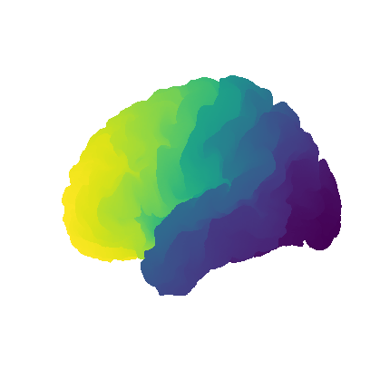
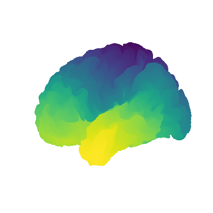
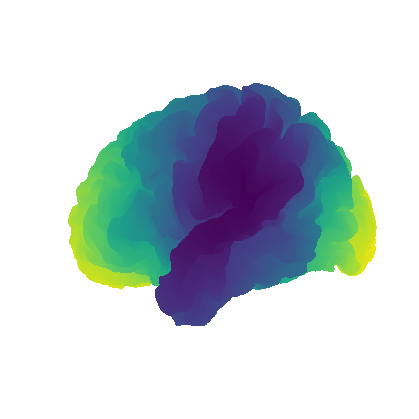

.. _tutorial_ownsurface:

Tutorial 3: Generating surrogate maps on your own surfaces
==========================================================

While the functions in ``eigenstrapping`` are validated and tested with standard
surface spaces, you can also generate nulls on your own surface `*.gii`. This is 
basically what happens with the subcortical surrogates (only these are `*.nii`)

You will need:

* A single neuroimaging format cortical mesh `*.gii`
* A brain map vector, in surface `*.shape.gii` or `*.func.gii` 
* A delimited `*.txt` file or a numpy array.

You would call the functions in exactly the same manner as before, but this
time we're going to use the class :class:`SurfaceEigenstrapping` since we assume you
want to save the eigenmodes and eigenvalues generated from the surface for
future use.

Important
^^^^^^^^^

If you have installed the ``scikit-sparse`` library, then generating eigenmodes
on your own surfaces will be much faster (particularly if the number of modes you
want to calculate are high). If this is not installed, then the routine will 
use ``scipy.sparse.linalg.splu`` instead (much slower).

.. code-block:: py
    
    >>> from eigenstrapping import SurfaceEigenstrapping, datasets
    >>> native = datasets.load_native_tutorial()
    >>> native
    {'surface': '/Users/nik/miniconda3/envs/eigen/lib/python3.9/site-packages/eigenstrapping/datasets/HCP/102816.L.midthickness_MSMAll.164k_fs_LR.surf.gii',
    'thickness': '/Users/nik/miniconda3/envs/eigen/lib/python3.9/site-packages/eigenstrapping/datasets/HCP/102816.L.MyelinMap_BC.164k_fs_LR.func.gii',
    'myelin': '/Users/nik/miniconda3/envs/eigen/lib/python3.9/site-packages/eigenstrapping/datasets/HCP/102816.L.corrThickness.164k_fs_LR.shape.gii'}

We expect there to be a non-zero correlation between the myelin map and the cortical thickness, but let's
test the significance of this result by generating eigenmodes on the surface they are projected to
and randomly resampling them to get surrogate maps with matched spatial autocorrelation.

.. code-block:: py

    >>> surface = native['surface']
    >>> myelin = native['myelin']
    >>> thickness = native['thickness']
    >>> eigen = SurfaceEigenstrapping(
                    surface=surface,
                    data=myelin,
                    num_modes=200,
                    use_cholmod=True #IMPORTANT: this will only work if you have `scikit-sparse` installed!
                    )
    Computing eigenmodes on surface using N=200 modes
    TriaMesh with regular Laplace-Beltrami
    Solver: Cholesky decomposition from scikit-sparse cholmod ...

    >>> emodes = eigen.emodes
    >>> print(emodes)
    array([[ 0.00316884, -0.0023195 , -0.00534001, ..., -0.00085954,
        -0.00160245,  0.00160581],
       [ 0.0053148 ,  0.00171283, -0.00341847, ..., -0.00107347,
         0.00499724,  0.00266957],
       [ 0.00276907,  0.0033566 ,  0.00208069, ..., -0.00177513,
        -0.0010117 ,  0.00481352],
       ...,
       [-0.00390473,  0.00401391, -0.0009278 , ...,  0.00306122,
        -0.0018166 ,  0.00296925],
       [-0.00387439,  0.00402319, -0.00089265, ...,  0.00292008,
        -0.0018992 ,  0.00316154],
       [-0.00386044,  0.0039866 , -0.00086383, ...,  0.00274796,
        -0.00211211,  0.00252366]])
    
Let's plot the first few eigenmodes on the surface to make sure they make sense.

.. code-block:: py

    >>> from nilearn import plotting
    >>> for i in range(3):
            y = emodes[:, i]
            plotting.plot_surf(
                surf_mesh=surface,
                surf_map=y
            )

We can use these eigenmodes to generate surrogate maps, but in order to check their
fit to the original variogram, we need to calculate the distance matrix first.
We can do this by using :func:`eigenstrapping.geometry.geodesic_distmat`. Bear
in mind this may take up to 8 hours depending on how dense the mesh is (this can
be sped up by using multiple processes and other things, see the function).
