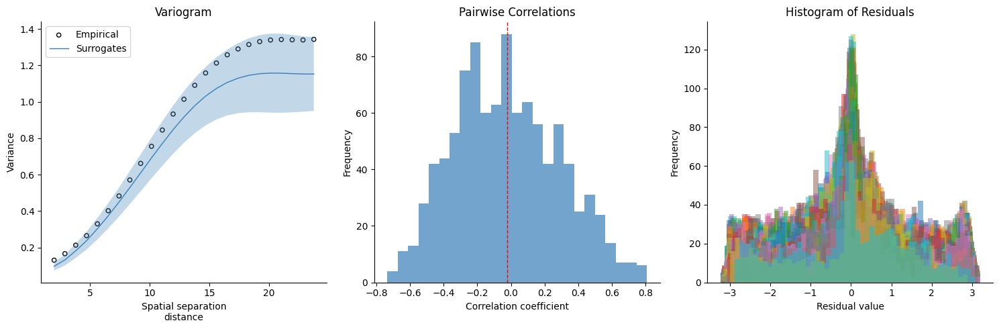

.. _tutorial_subcortex:

Tutorial 2: Generating surrogate subcortical maps
=================================================

While the majority of spatial nulls work best with cortical data in surface space,
``eigenstrapping`` can also generate nulls based on subcortical data in volumetric
space. If you have these two things:

* A subcortical map, i.e., a volume or delimited `*.txt` file
* A mask image, i.e., a label volume

then generating subcortical nulls is simple.

You would call the function in a similar manner as the cortical fit:

.. code-block:: py

    >>> from eigenstrapping import fit, datasets
    >>> hipp_data, hipp_mask = datasets.load_subcort(structure='hippo')
    
    >>> hipp_surrs = fit.volumetric_fit(
                        x=hipp_data,
                        volume=hipp_mask,
                        nsurrs=1000,
                        num_modes=100,
                        resample=True,
                        return_data=True
                        )

    preprocessing...done
    starting generation of surface...
    slice nb 30...
    slice nb 40...
    constructing final surface...
    (surface with 2056 faces and 1030 vertices)...done
    computing the maximum edge length...2.828427 mm
    reversing orientation of faces...
    checking orientation of surface...
    0.000 % of the vertices (0 vertices) exhibit an orientation change

    counting number of connected components...
    1030 voxel in cpt #1: X=2 [v=1030,e=3084,f=2056] located at (-23.000000, -31.722330, 7.277670)
    For the whole surface: X=2 [v=1030,e=3084,f=2056]
    One single component has been found
    nothing to do
    writing out surface...done
    --> VTK format         ... 
    --> DONE ( V: 1449 , T: 5168 )

    TetMesh with regular Laplace
    Solver: spsolve (LU decomposition) ...
    IMPORTANT: EIGENMODES MUST BE TRUNCATED AT FIRST NON-ZERO MODE FOR THIS FUNCTION TO WORK
    
    >>> hipp_surrs.shape
    (1000, 952)

IMPORTANT: The above function uses external libraries (``gmsh`` and FreeSurfer ``mri_mc``)
to generate the subcortical meshes based on the `volume`. The above code will
output a few figures as with the :func:`eigenstrapping.fit.surface_fit` function:

    
In the above example, we loaded subcortical data where the data is a volume in
MNI152 2mm space (based on cortico-subcortical gradients generated using the
connectopic mapping approach, see :ref:`References <references>`), and the mask 
image is a label volume in MNI152 space where the ROI is labelled as "1" and the
non-ROI (the rest of the volume) is labelled "0". It is important to make sure
this is the case!
